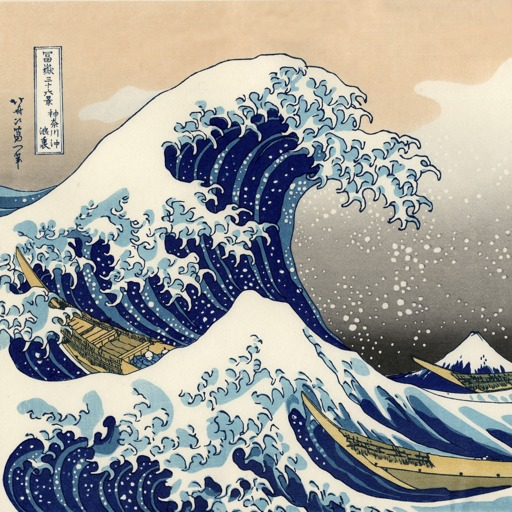
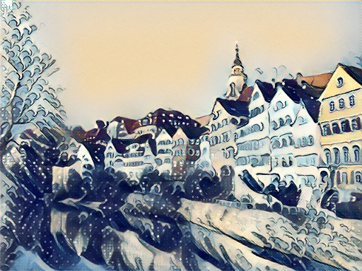
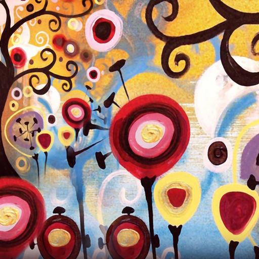
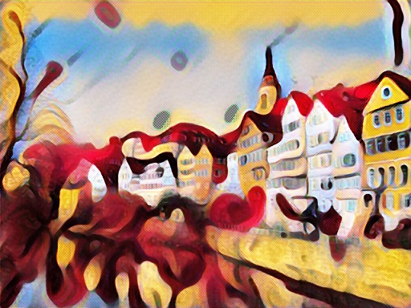
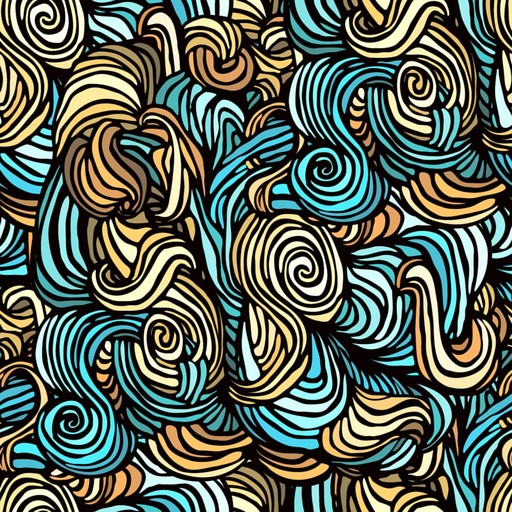
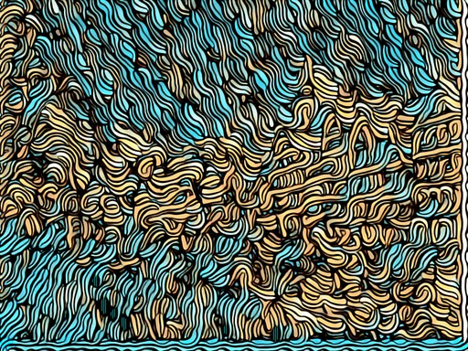
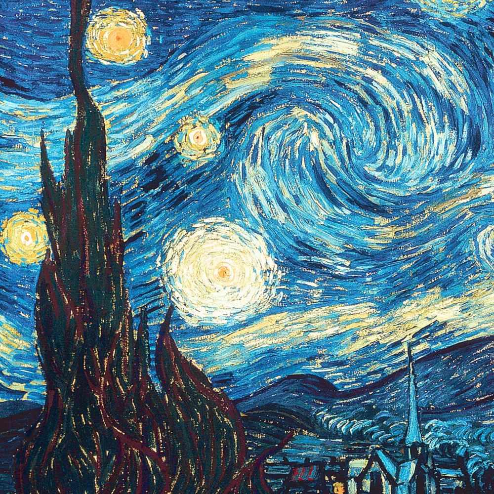
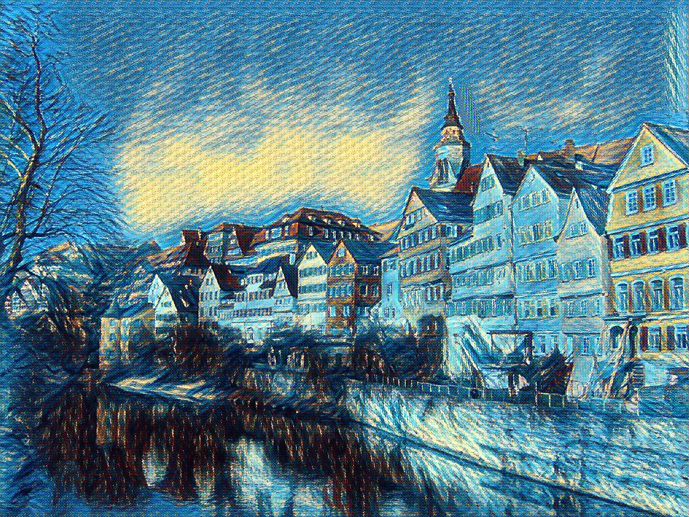

# chainer-fast-neuralstyle-models

Some models trained by different people using the [chainer fast neuralstyle app](https://github.com/yusuketomoto/chainer-fast-neuralstyle) by yusuketomoto.
Please note, there has been a change on how the models are trained which makes them not suitable for the most recent version relased. Will update here soon.

The animated gifs have been created with a simple "real-time" video capture wrapper written in python. The code is available at https://github.com/gafr/chainer-fast-neuralstyle-video

## Compatible with old code ([0d96350](https://github.com/yusuketomoto/chainer-fast-neuralstyle/tree/0d96350))

ModelName | Reference | Parameters | Style | Samples
--- | --- | --- | --- | ---
starrynight | [chainer-fast-neuralstyle](https://github.com/yusuketomoto/chainer-fast-neuralstyle) | unknown | |  
cubist | [cubistMirror](https://github.com/genekogan/CubistMirror/) | unknown | | 
hokusai | [cubistMirror](https://github.com/genekogan/CubistMirror/) | unknown | | 
hundertwasser | - | 1000 training images, 2 epoches, training: size 512 (full) | | 
kandinsky | uploaded by [6o6o](https://github.com/6o6o) | full coco training set, 2 epoches, training size 512 (cropped) | |  
kandinsky | uploaded by [6o6o](https://github.com/6o6o) | full coco training set, 2 epoches, training size 512 (full) | | 
edtaonisl | uploaded by [6o6o](https://github.com/6o6o) | full coco training set, 2 epoches, training size 512 (cropped) | |  

## Compatible with new code

Model Name | Reference | Parameters | Style | Samples
--- | --- | --- | --- | ---
Kanagawa | [6o6o](https://github.com/6o6o) | full coco, 2 epochs, image_size 512 (crop) | | 
Candy | [Heartsie](https://github.com/Heartsie) | full coco, 2.6 epochs, image_size 512 (crop) | | 
Fur | [6o6o](https://github.com/6o6o) | full coco, 1 epoch, image_size 512 (crop) | | 
Starry Night | [DylanAlloy](https://github.com/DylanAlloy) | full coco, 2 epochs, image_size 512 (crop) | | 
