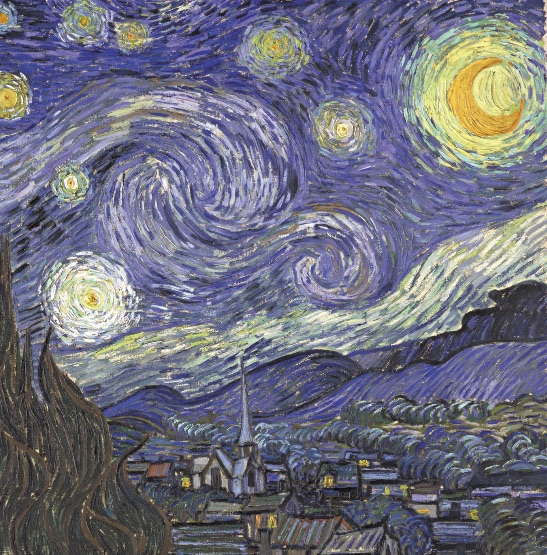
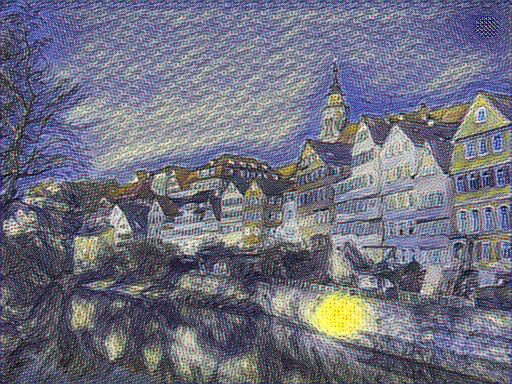
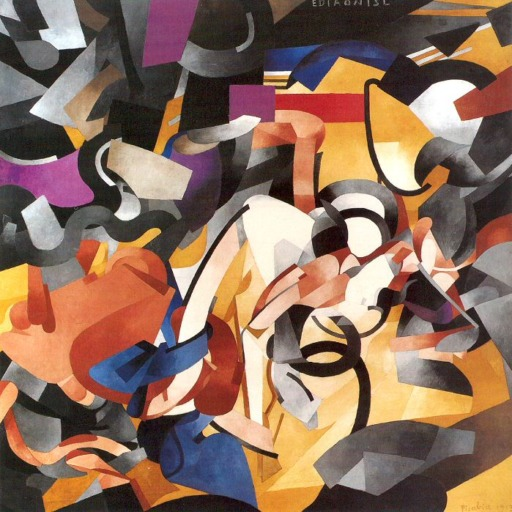
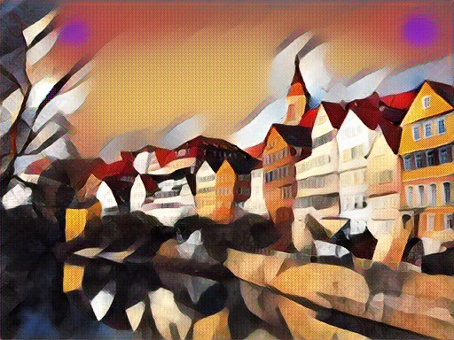

# chainer-fast-neuralstyle-models

Some models trained by different people using the [chainer fast neuralstyle app](https://github.com/yusuketomoto/chainer-fast-neuralstyle) by yusuketomoto.
Please note, there has been a change on how the models are trained which makes them not suitable for the most recent version relased. Will update here soon.

The animated gifs have been created with a simple "real-time" video capture wrapper written in python, will release the code shortly.

ModelName | Reference | Parameters | Style | Samples
--- | --- | --- | --- | ---
starrynight | [chainer-fast-neuralstyle](https://github.com/yusuketomoto/chainer-fast-neuralstyle) | unknown | |  
cubist | [cubistMirror](https://github.com/genekogan/CubistMirror/) | unknown | | 
hokusai | [cubistMirror](https://github.com/genekogan/CubistMirror/) | unknown | | 
hundertwasser | - | 1000 training images, 2 epoches, training: size 512 (full) | | 
kandinsky | uploaded by [6o6o](https://github.com/6o6o) | full coco training set, 2 epoches, training size 512 (cropped) | |  
kandinsky | uploaded by [6o6o](https://github.com/6o6o) | full coco training set, 2 epoches, training size 512 (full) | | 
edtaonisl | uploaded by [6o6o](https://github.com/6o6o) | full coco training set, 2 epoches, training size 512 (cropped) | |  
